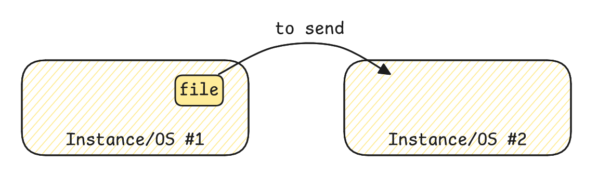
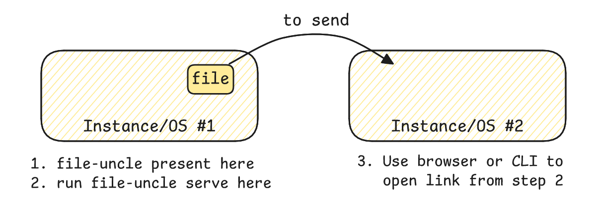
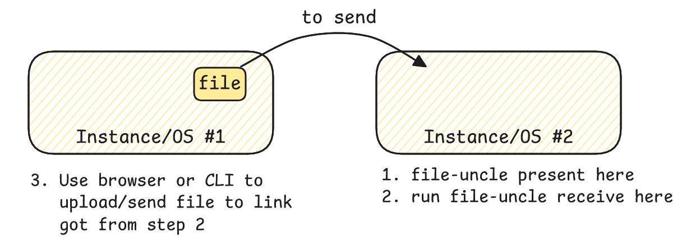

# File Uncle (WIP)

file-uncle, an anywhere to anywhere file transfer utility using http.

## Features

- **Receive Files**: Create a http server to Receive files from anywhere via http.
- **Serve Files**: Create a http file server to let anyone download the file from your system.

## Installation

To install File Uncle, follow these steps:

1. Clone the repository: `git clone https://github.com/theadarshsaxena/file-uncle.git`
2. Navigate to the project directory: `cd file-uncle`
3. Run the project: `go run .`

## Usage


### Prerequisite
1. You need to install file-uncle in one system

### Case #1: file-uncle installed in system #1


- Install file-uncle in system #1
- Run `file-uncle serve` command to start a http server in system #1
	- Both system in same network
		```
		file-uncle serve --host <IPOfServer#1>
		```
	- System on different network (send via internet)
		```
		file-uncle serve --with-ngrok
		```
- Above command will return a link, which will open a http page in browser with a list of files to download.
- Note: To download the files from CLI (system #2), use wget after copying link for any file by opening first in browser.

### Case #2: file-uncle installed in system #2


- Install file-uncle in system #2
- Run `file-uncle receive` command to start the http server, it starts the server at 8080 (by default) and it also provide a webUI to upload the files
	- Both system in same network
		```
		file-uncle receive --host <IPOfServer#2>
		(or)
		file-uncle receive --host <IPOfServer#2> --user <username> --password <somepassword>
		```
	- System on different network (send via internet)
		```
		file-uncle receive --with-ngrok
		(or)
		file-uncle receive --with-ngrok --user <username> --password <somepassword>
		```
- Now, from system #1, open the link given by above command in browser and upload the file
- Note: To send file from system #1 using CLI, follows the below steps:

### Sending Files via CLI (curl)

In addition to this, if you want to send the files via CLI in remote system, you the following commands:
1. To upload a file to the server using curl:

	```sh
	curl -F "uploadFile=@/path/to/your/file" http://localhost:8080/
	```

2. If authentication is enabled:

	```sh
	curl -u username:password -F "uploadFile=@/path/to/your/file" http://localhost:8080/
	```

### Encrypting and Decrypting Files

For better security when sending the file via tunnel, e.g., ngrok, prefer sending the encrypted file.
You can encrypt a file before sending and decrypt it after receiving using OpenSSL (AES-256) as follows:

1. Encrypt before sending:

	```sh
	openssl enc -aes-256-cbc -salt -in /path/to/your/file -out /path/to/your/file.enc -k yourpassword
	```

2. Send the encrypted file:

	```sh
	curl -F "uploadFile=@/path/to/your/file.enc" http://localhost:8080/
	```

3. Decrypt after receiving:

	```sh
	openssl enc -d -aes-256-cbc -in /path/to/received/file.enc -out /path/to/decrypted/file -k yourpassword
	```

	Replace `/path/to/your/file` and `yourpassword` with your actual file path and password.

### Using Ngrok for sending/receiving via internet

1. To expose your server to the internet, use the built-in ngrok integration:

	 - Add the `--with-ngrok` flag to either the `serve` or `receive` command:
		 ```sh
		 ./file-uncle serve --with-ngrok
		 ./file-uncle receive --with-ngrok
		 ```
	 - Set the following environment variables before running the command:
		 - `NGROK_AUTHTOKEN`: Your ngrok authtoken (required for authentication)
	 - The tunnel endpoint will be printed in the console when started.
	 - When you stop the server with CTRL+C, the tunnel will be closed


## Contributing

Contributions are welcome! If you have any ideas, suggestions, or bug reports, please open an issue or submit a pull request. Make sure to follow our [contribution guidelines](CONTRIBUTING.md).

## Development

### Building from Source

To build the project from source:

```bash
go build -o file-uncle ./cmd/file-uncle/main.go
```

### Tailwind CSS

This project uses Tailwind CSS for styling. To regenerate the CSS:

```bash
# One-time build
npm run tailwind

# Watch mode for development
npm run tailwind:watch
```

The Tailwind configuration is defined in `tailwind.config.js` and scans the HTML files in `internal/src/html/` for utility classes.

### Releasing

This project uses **GoReleaser** to automate building and releasing binaries for multiple platforms. The configuration is in `.goreleaser.yaml`.

#### What GoReleaser Does:

- **Pre-release Verification**: Runs `go mod tidy` and tests before building
- **Multi-platform Compilation**: Builds binaries for:
  - Linux (amd64, arm64)
  - macOS/Darwin (amd64, arm64)
  - Windows (amd64)
- **Optimization**: Reduces binary size using optimized linker flags
- **Checksums**: Generates SHA256 checksums for all binaries
- **Changelog Generation**: Automatically generates changelogs from commits organized by type:
  - 🎯 Features (commits with `feat:`)
  - 🐛 Bug fixes (commits with `fix:`)
  - ⚡ Performance improvements (commits with `perf:`)
  - Others
- **GitHub Releases**: Publishes releases to GitHub with formatted notes and downloadable binaries

#### To Create a Release:

1. Tag a commit with a version number:
   ```bash
   git tag v1.0.0
   git push origin v1.0.0
   ```

2. GoReleaser will automatically trigger (if configured with GitHub Actions) or manually run:
   ```bash
   goreleaser release --clean
   ```

3. The release will be published to [GitHub Releases](https://github.com/theadarshsaxena/file-uncle/releases) with all built binaries.

#### Setting Up GitHub Actions for GoReleaser

The GitHub Actions workflow is configured in `.github/workflows/goreleaser.yaml`. Here's how to set it up:

**Step 1: Ensure the Workflow File Exists**
- The workflow file is already included in the repository at `.github/workflows/goreleaser.yaml`
- It automatically triggers when you push a git tag with version format `v*` (e.g., `v1.0.0`)

**Step 2: Verify GitHub Token Permission**
- Go to your GitHub repository settings
- Navigate to: **Settings** → **Actions** → **General**
- Under "Workflow permissions", select "Read and write permissions"
- This allows GitHub Actions to create releases

**Step 3: Create and Push a Tag**
```bash
# Create a local tag
git tag v1.0.0

# Push the tag to GitHub
git push origin v1.0.0
```

**Step 4: Monitor the Workflow**
- Go to your repository on GitHub
- Click on the **Actions** tab
- You'll see the "GoReleaser" workflow running
- Wait for it to complete (usually 2-5 minutes)

**Step 5: Check the Release**
- Once completed, go to **Releases** tab
- You'll see the new release with all built binaries and checksums

#### What the Workflow Does:

```yaml
- Triggers: When you push a version tag (v1.0.0, v1.1.0, etc.)
- Checks out code with full git history
- Sets up Go environment
- Sets up Node.js for Tailwind CSS
- Builds CSS using npm
- Runs GoReleaser to build and publish binaries
- Automatically publishes release to GitHub
```

#### Troubleshooting:

**Workflow not triggering?**
- Make sure you're pushing tags: `git push origin v1.0.0`
- Tags must match the pattern `v*` (e.g., `v1.0.0`)
- Check **Actions** tab to see if workflow runs

**Release not being created?**
- Verify "Workflow permissions" are set to "Read and write"
- Check the workflow logs in the **Actions** tab for errors
- Ensure `.goreleaser.yaml` is configured correctly

**Local Testing (Optional):**
If you want to test GoReleaser locally before pushing:
```bash
# Install GoReleaser
brew install goreleaser  # macOS
# or download from https://goreleaser.com/

# Create a dry-run (without publishing)
goreleaser release --skip=publish --clean
```

## License

This project is licensed under the [MIT License](LICENSE).

